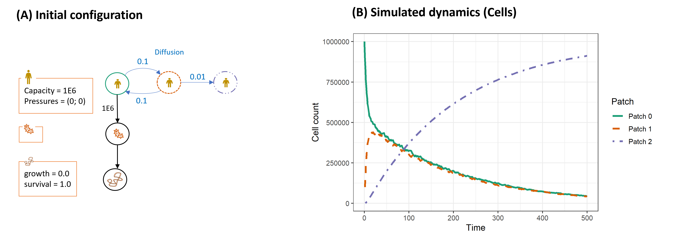

```{r setup, include=FALSE}
knitr::opts_chunk$set(echo = TRUE)
```
*Note: Simulations were not run on-the-fly in this .Rmd document. They were conducted beforehand with presented R code, stored and re-loaded to generate this document.*


# 1.INTRODUCTION

The primary motivation of the development of the *msevol* (**M**ulti-**S**caled 
**E**VOLution) framework is the stochastic simulation of large bacterial 
populations in the context of antimicrobial resistance epidemics. Such biological 
systems are characterized by <u>**1) a nested organization of 
different evolutive units**</u> (e.g. resistance genes carried by chromosomes or 
mobile genetic elements, which are in turn are carried by bacteria organized 
in populations competing for resources in some patient populations 
structured in hospital wards, ... [@Baquero2013]); and <u>**2) very large 
populations of possibly identical elements.**</u>    


## 1.1. Rationale for the use of MDAG

Nested systems are typically represented using inclusion trees. This is notably 
the case in the membrane computing framework used to develop ARES (Antimicrobial
Resistance Evolution Simulator), a simulator of antimicrobial resistance in 
hospital-settings [@Campos2015; @Campos2019; @Campos2020]. However, the tree
architecture inherently creates redundancy of identical elements, that are 
duplicated when contained within different contexts. Such redundancy strongly 
limits the size of the simulated population, that could bias the occurrence of 
rare events involved in antimicrobial resistance. To circumvent this redundancy 
and to enable the simulation of very large populations, *msevol* intends to use 
a compressed, non-redundant representation of the inclusion tree, i.e. minimal 
directed acyclic graph (MDAG), in which every identical subtrees are merged 
together to appear only once (Figure 1).  


By using MDAG, *msevol* seeks to balance between computational efficiency 
offered by population approaches and flexibility offered by Agent-based 
simulations. Large populations of similar elements are handled as a single 
element, both in memory and in computation. All stochastic events affecting 
this elements can be computed once at the population level, provided that there 
is an effective distribution of these changes to higher levels. Consequently, 
computational complexity is expected to increase only with the size of the MDAG,
hence with the number of unique entities (MDAG nodes) and their connectivity 
(MDAG edges), rather than with the size of the population.


## 1.2. Basics of the *msevol* formalism

In *msevol*, a biological entity is assumed to be entirely defined by its type 
(e.g. a bacterial cell), its content (i.e. a set of lower-level entities, such 
as mobile genetic elements), and its properties (i.e. a set of parameters that 
control its behavior, such as the exponential growth rate of bacteria). 
These properties result from intrinsic properties (i.e. fixed parameters 
specific to the agent regardless of its content) modulated by the properties 
of its contents (e.g. the basal growth rate of a bacterium modulated by 
the fitness cost imposed by plasmids and ARG carried by the cells). They are 
assumed to be context-independent, meaning that they cannot depend on the 
upper-level entity containing the element. 

Consequently, a biological element can formally viewed as the following tuple :

$$ 
A_i =  \left( id^{(i)}, L^{(i)},  P_{intrinsic}^{(i)}, f_{prop}, e^{(i)}   \right)
$$
  
where:  

* $id^{(i)}$ is the identifier of the element,  

* $L^{(i)}$ represents its label (i.e. its type),  

* $P_{intrinsic}^{(i)}$ its intrinsic properties,  

* $e^{(i)}$ is a set of inclusion edges $id^{(i)} \xrightarrow{m_j} id^{(j)}$ 
indicating that the element contains $m_j$ elements $j$, and  

* $f_{prop}$ is a 'propagation' function indicating how the intrinsic properties 
of the element are modulated by the properties of its content (i.e. 
$P_{current}^{(i)} = f_{prop} \left( P_{intrinsic}^{(i)}, e^{(i)} \right)$).


<br>
<br>
  
  
Viewed as a set of nested agents, a full eco-biological *msevol* model is 
formally represented by the following tuple :

$$
   msevol = \left(S, G, A_1, ..., A_n, L_1,  ..., L_m, f_1, ..., f_k, Event_1, ..., Event_p   \right)
$$

where :  

* $S$ is the schema graph that specifies which agents (= vertices) and which
 relationships between them (= edges) can be included in any given configuration 
of $G$;    

* $A = {A_1, ..., A_n}$ is a set of unique agents actually composing the 
ecosystem;  

* $L = {L_1, ..., L_m}$ is a set of labels, also called *archetypes*. They  
represent the type and the intrinsic properties of agents ${A_i}$ that contain 
it. 

* $G$ is a minimal directed acyclic graph (MDAG) representing the hierachical 
architecture between agents/labels $A_1$ ... $A_n$, $L_1$, ..., $L_m$. 


* $f_{prop}= {f_1, ..., f_k}$ is a set of propagation functions indicating how 
properties, i.e. attributes attached to vertices (= agents or labels) propagate 
from containees to containers;

* $E = {Event_1, ..., Event_p}$ is a set of stochastic evolution events
specifying the behavior and dynamics of the biological entities during a 
simulation. They are implemented as graph rewriting rules that modify nodes and
edges multiplicities while avoiding redundancy of agents. Their probability of 
occurrence is directly controled by the agent's properties.


It is noteworthy that $S$, $f$ and $E$ define a generic biological model, whereas
$A$, $L$ and $G$ represent a given configuration of this model.


## 1.3. Overview of the *mse1* simulator

The pilot *msevol* implementation consists of two main components (Figure 3): 
one in C++ and the other in R. The C++ component handles basic operations on 
MDAG, which are common to all ecosystems regardless of the biological agents or 
events. It also includes an ecosystem dedicated to antimicrobial resistance 
(detailed in section [1.4.](#mse1mod)), i.e. a fixed set of $S$, $\{f_i\}$ and 
$\{Event_i\}$ with previous notations. Finally, it generates the corresponding 
simulator as an executable, enabling the user to run a simulation with any 
admissible initial configuration (i.e. any $G$, $\{A_i\}$ and $\{L_i\}$ 
compatible with $S$).  

The second component is a collection of R scripts that manage the simulations. 
These scripts facilitate model input/output formatting, handle the execution 
of the .exe file, and provide tools for data visualization and analysis.


## 1.4. Current biological model {#mse1mod}


### 1.4.1. Admissible schema graph

*mse1* models the dynamics of antibiotic **resistance genes** (ARGs), which 
reduce sensitivity to bactericidal antimicrobials (by decreasing the 
probability of antibiotic-induced death) while imposing a metabolic 
cost on the host bacteria (reflected as reduced growth). Resistance genes can 
be located either on the **chromosome**, which determines the bacteria's 
baseline growth and natural death rates, or on **plasmids**, whose backbone may 
impose an additional cost independent of the ARGs they carry. **Bacterial cells** 
containing one or more replicons are organized into distinct metapopulations 
(also called **patches**), where they compete for resources under shared stress 
conditions and can migrate between patches. Bacteria can diversify from their 
original genotype through the acquisition of plasmids circulating 
within the same patch or by losing costly plasmids through 
random segregation.
  
  


### 1.4.2. Biological events

<span style="color:lightblue;">
*Figures 6 to 10 are based on simulations run using the R script "msevolr/documentation/tutorial_figures/Base_events_scripts.R"*
</span>


#### <u>Bacterial growth and death</u>

**[Event 1 - Cell birth]** A within-patch birth event (i.e. cell division) of a 
cell $j$ in a patch $k$ occurs with probability $P^{(birth)}_{j,k} = β_j^{eff} (1-N_k/K_k)$  
where $β_j^{eff}$ is the effective birth probability of the cell $j$, $K_k$ is 
the carrying capacity of the patch $k$ and $N_k$ is the total number of cells 
in this patch (= occupancy). This mimics a logistic growth, where cells compete 
for the niche resources. The effective birth probability $β_j^{eff}$  depends on
their chromosomic nominal birth probability $β^0_j$, weighted by the relative 
fitness $c_i$ of all the ARG and plasmids contained by the cell. This event is 
applied once per multiplicity edge connecting patches and cells (noted 
$E<Cell_j, Patch_k, m_{j,k} >$) and consist only in a change of the multiplicity
following a binomial draw : 
$m_{(j,k)}  \leftarrow  m_{(j,k)}+ \mathcal{B} \left( m_{(j,k)}, P^{(birth)}_{j,k} \right)$.


**[Event 2 - Cell death]** A within-patch death event of a cell $j$ in a patch 
$k$ occurs with probability 
$P^{(death)}_{j,k} = 1- (1- δ_k)\prod_{i=1}^{l}(1- s_{i,k}a_{i,k})$,
where $𝛿_k$ is the cell’s nominal death probability, $a_{i,k} ∈ [0,1]$ is the 
selective pressure imposed by the  i<sup>th</sup> antibiotic in patch $k$ and $s_{i,k}$ is 
the j<sup>th</sup> cell’s susceptibility level to this antibiotic. Stresses $a_{i,k}$ 
depend on the niche in which the competition takes place. The cell’s 
susceptibility to the i<sup>th</sup> antibiotic depends on the set of ARGs held by the 
cell.  It is obtained as the product of $s_{l,k}= \prod_{q}s_{l, q}^{m_{q,j}}$ 
with $m_{q,j}$ represent the number of occurrence of the q<sup>th</sup> unique ARG in 
the cell $j$.  This formulation allows to represent ARGs providing no 
resistance ($s = 1$) or partial resistance ($0 < s <1$) whose accumulation 
can increase resistance. Although taking $s$ strictly equal to 0 is not 
permitted due to calculation constraints, (quasi-)complete resistance can be 
obtained by taking $s$ as small as computationally possible, so that additional 
ARGs against the same antibiotic provide no added benefit to the cell. 


Just like the birth event, the death event is applied once per multiplicity edge 
connecting patches and cells and consists only in an update of its multiplicity 
following a binomial draw with probability $P^{(death)}_{j,k}$ :
$m_{(j,k)}  \leftarrow  m_{(j,k)}- \mathcal{B} \left( m_{(j,k)}, P^{(death)}_{j,k} \right)$.


#### <u> Plasmid dynamics</u>

**[Event 3 - Plasmid conjugation]** A within-patch plasmid transfer event of a 
plasmid $p$ (= conjugative transfer of a plasmid from a donor to a recipient 
cell) occurs in the patch $k$ following a mass-action law that stands for the 
probability of contact between cells as a function of the density of plasmid 
donors and recipients in the niche [@stewart1977; @lopatkin2017]. 
The effective probability that a compatible recipient accepts a plasmid is 
$P^{transfer}_{p,k} = \frac{n_{d,k}}{K_k} \left( 1- (1 - ρ_p) \right) ^{n_p}$    
where $ρ_p$  is the plasmid’s nominal transfer probability, $n_{d,k}$ is the 
number of donors cells (i.e. cells containing at least one plasmid $p$) in the 
patch $k$, $K_k$ is the niche’s carrying capacity (treated as a volume) and $n_p$
is the average plasmid copy number among donors. Plasmid host ranges are modeled 
using a restrictive range of recipient cells, materialized by a “Plasmid range edge” 
between a plasmid type and a chromosome: for a given plasmid, a recipient cell 
is a cell which carries one compatible chromosome, and which does not carry more 
than $max_count$ plasmids of the same archetype. 
  
The transfer event is applied once per putative recipient cell $j$ located in 
patch $k$ inwhich the plasmid was circulating. It consists in (1) a binomial 
draw of cells actually receiving the plasmid 
$n_j ~ \mathcal{B} \left( m_{(j,k)}, P^{transfer}_{p,k} \right)$; (2) if it 
does not exist yet, the creation of the variant cell $j’$ having the same content 
of the cell $j$ with an additional plasmid $p$; and (3) an update of 
multiplicities $m_{j,k}  \leftarrow   m_{j,k}-n_j$ and 
$m_(j',k)   \leftarrow   m_(j',k)+ n_j$.


**[Event 4 - Plasmid segregation]** A within-cell plasmid loss event (= plasmid 
random segregation) occurs with the probability $P^{loss}_p$  depending only 
of the plasmid $p$.  To date, a cell can lose at most one plasmid per event, 
and the loss event is applied once per plasmid $p$ per unique cell $j$ containing 
the plasmid $p$, and per patch $k$ containing the cell $j$. 
It consists in (1) a binomial draw of the number cell actually loosing the 
plasmid $n_j ~ \mathcal{B} \left(m_{(j,k)}, P^{loss}_{p} \right)$; (2) if it 
does not exist yet, the creation of the variant cell $j’$ having the same content 
of the cell $j$ less one plasmid $p$ and located in patch $k$ with multiplicity 
$m_{j’,k}$; and (3) an update of multiplicities $m_{j,k}  \leftarrow   m_{j,k}-n_j$ 
and $m_{j',k}   \leftarrow   m_{j',k}+ n_j$.


<br>

#### <u>Between-patch cell migration</u>

**[Event 5 - Cell migration]**  Between-patches bacterial migration is possible 
for every pair of patches $<k, k’>$ related by a diffusion edge. Diffusion 
occurs with the probability $P^{diff}_{k \rightarrow k'}$   attached to the 
diffusion edge. $P^{diff}_{k \rightarrow k'}$   corresponds to the probability 
that one individual cell located in niche $k$ migrates to the other linked niche
$k’$. It is independent of the cell which actually migrates and depends only of 
the two niches. 

The migration event is applied once per multiplicity edge $E<Cell_j, Patch_k, m_{j,k}>$ and 
per patch-to-patch diffusion edge $E< Patch_k , Patch_{k’} , P^{diff}_{k \rightarrow k'}>$.
It consists in : (1) a binomial drawing of the number of moving cells 
$n_j  ~ \mathcal{B} \left(m_{j,k}, P^{diff}_{k \rightarrow k'} \right)$, (2) a 
creation of a new multiplicity edge $E<Cell_j, Patch_{k’}, m_{j,k’} =0 >$ if it
does not already exist,  and (3) an update of both multiplicities 
$m_{j,k} \leftarrow m_{j,k}-n_j$ and $m_{j',k}  \leftarrow   m_{j',k}+ n_j$.

To date, the diffusion network structure (edge and probabilities) is fixed by
the user at the beginning of the simulation.




# 2. INSTALLATION

## 2.1. Download

The *mse1* simulator can be downloaded from
<span style='color:red;'> GITHUB link </span>. The provided files include the 
C++ source code (`msevol_msvc`) for generating the executable, along with a set 
of R scripts (`msevolr`) used to interface with the simulator. 


## 2.1. Generating the msevol client 

To compile C++ source code in Visual Studio, first open Visual Studio and open 
the *msevol* project (`msevol.sln`). Next, choose the build configuration (Debug 
or Release) and platform (e.g. x64). Finally, click on 'Build' from the top menu 
and select 'Build Solution'. Visual Studio will compile the source code and 
generate the executable file and will copy it in the folder `msevolr/bin` so 
that it can be directly used from R. 

Once the executable has been generated, the C++ source code is no longer needed 
and can be disregarded.


## 2.2. R setup instructions

The R component of the simulator (`msevolr`) is organized into several 
key folders:

* The `bin` folder, initially empty, must contain the *msevol* executable, 
`msevocli.exe` generating when compiling the C++ source code. This folder is 
used during each simulation to (possibly temporarily) store the initial 
configuration of the model and the results of the simulation.

* The `msvr_fun` folder includes R scripts that configure a new 
initial model, launch the executable to run the simulation with this 
configuration, and analyze the outputs using R. It contains:

  + the file `cfg_funcs_v1.0.R` (for model configuration and 
  simulator launching)
  
  + the file `parse_funcs.R` (for converting C++ output into an 
  R list)
  
  + the file `helper_fun.R` (for plotting and verifying the 
  initial configuration, as well as performing basic analyses and manipulations 
  to interpret R-formatted results)
  
  + the file `basics.R` (optional, for basic scenarios and consistency 
  checks)  

These two folders are mandatory and should be copied anywhere in the same root 
directory. Other folders are provided for informational purposes only and are 
not required for running and analyzing a simulations. They include relevant 
documentation and cover basic and advanced use cases, which are described 
in more detail in this tutorial.

<br>

Some required R packages need to be downloaded and installed for these scripts 
to run : 
 
+ <u>model configuration and simulator launching </u> :  data.table, tidyr, bit64

+ <u>model visualization </u> : ggplot2, visNetwork

+ <u> specific use case</u> : foreach, doParallel


## 2.3. Third-party software 
The mathematical functions are provided by the Rmath library under LGPL license, 
available at 
[https://github.com/wch/r-source/tree/trunk/src/nmath](https://github.com/wch/r-source/tree/trunk/src/nmath). 
The Rmath is linked as a dynamic library to prevent GPL infection. Once compiled, 
place the file `Rmath.dll` in a directory, and make sure to add this directory 
to the Windows environment variable.


# 3. USAGE


## 3.1	Pre-simulation instructions

Before any R simulations with *mse1*, you must ensure the working directory is 
correctly set and all relevant packages and functions are properly 
loaded before proceeding with the simulation: 

1. set the working the working directory to the root folder containing the 
necessary `bin` and `msvr_fun` subdirectories 

2. load required R packages,

3. Sources essential functions for the simulation. 


```{r headers, echo = TRUE, message = FALSE}

##----------------------------------------------------------------------------##
## Options, packages and generic functions
##----------------------------------------------------------------------------##

## WORKING DIRECTORY
## Set the working directory to the root folder that directly contains 'bin' 
## (with the msevocli.exe client) and 'msvr_fun' (which contains the R 
## functions needed to use the simulator)

setwd("C:/Users/Lenuzza/Desktop/clean_msevol/msevolr") 


## PACKAGES

library(data.table)
library(tidyr)
library(ggplot2)
library(visNetwork)
library(bit64)


## SOURCING FUNCTIONS

source("msvr_fun/cfg_funcs v1.0.R")
source("msvr_fun/parse_funcs.R")
source("msvr_fun/helper_funcs.R")


```
  


## 3.2.	Configuring a new model

### 3.2.1. Format of the *msevolcli.exe* input graph

`msevolcli.exe` requires an input folder with the initial graph configuration 
stored in .csv files organized as a relational database. This includes files 
detailing the graph's vertices (such as IDs and optional attributes) and other 
files describing the relationships between vertices, i.e. the edges (including 
source, target, and optional edge attributes like multiplicity). In particular, 
due to C++ implementation requirements based on metaprogramming, it is necessary 
to have one table for each type of admissible vertex and one table for each 
admissible type of edge, totaling `r length(emptymodel())` tables. The names 
and formats of these tables are detailed below.

<br>

**Tables of archetypes** (i.e. labels) store the intrinsic properties of all the
unique containers

Name                       | Columns      | Columns' names and types                 |
---------------------------| -------------|------------------------------------------|
**Vertex_GeneArchetype**       | 4            | id *[positive integer]* <br> susceptibility.0 *[0<numeric ≤ 1]* <br> susceptibility.1 *[0<numeric ≤ 1]* <br> fitness *[0 ≤numeric ≤ 1]*                 |
**Vertex_ChromosomeArchetype** | 3            | id *[positive integer]* <br> fitness *[0 ≤numeric ≤ 1]* <br> survival *[0 ≤numeric ≤ 1]*         |
**Vertex_PlasmidArchetype**    | 5            | id *[positive integer]* <br> loss *[0 ≤numeric ≤ 1]* <br>transfer *[0 ≤numeric ≤ 1]* <br> max_count *[positive integer]* <br> fitness *[0 ≤numeric ≤ 1]*            |
**Vertex_CellArchetype**       | 1            | id *[positive integer]*              |
**Vertex_PatchArchetype**      | 4            | id *[positive integer]* <br> capacity *[0<numeric]* <br> pressure.0 *[0 ≤numeric ≤ 1]* <br> pressure.1 *[0 ≤numeric ≤ 1]*              |


**Tables of agents** store only identifiers. Indeed, current properties are
not configured by the user. They depend on agent's archetype and content and 
are automatically updated by the simulator during a simulation.


Name                       | Columns      | Columns' names and types                 |
---------------------------| -------------|------------------------------------------|
**Vertex_Gene**            | 1            | id *[positive integer]*  |
**Vertex_Chromosome** |  1            | id *[positive integer]*  |
**Vertex_Plasmid**    |  1            | id *[positive integer]*  |
**Vertex_Cell**       | 1            | id *[positive integer]*  |
**Vertex_Patch**      |  1            | id *[positive integer]*  |


**Tables of admissible inclusion edges** are named "Edge_*containee*_*container*_Multiplicity",
where "*containee*" and "*container*" refer to one of the possible agents (e.g.
`Gene`, `Plasmid`, `Chromosome`, `Cell` or `Patch`) or labels (`GeneArchetype`, 
`PlasmidArchetype`, `ChromosomeArchetype`, `CellArchetype` or `PatchArchetype`). 
Each table contains three columns identically named "source", "target", and 
"multiplicity". The "source" (resp. "target") points to an identifier in the 
"Vertex_*containee*" (resp. "Vertex_*container*") table, and `multiplicity` stores 
the number of containees. 

**Tables of other admissible** edges include patch-to-patch diffusion edges 
(`Edge_Patch_Patch_Diffusion`) and plasmid host range edges 
(`Edge_PlasmidArchetype_ChromosomeArchetype_PlasmidRange`). These tables follow 
the same format as the inclusion edges, with columns for `source`, `target`, and, 
when applicable, `attribute`. The source and target reference identifiers 
from the relevant vertex tables, as indicated by the edge table name.


Name  | Source table  | Target table    | Attribute  |
------|------------------|-----------------|------------|
**Edge_GeneArchetype_Gene_Multiplicity** |   GeneArchetype  |Gene         | multiplicity  |
**Edge_CellArchetype_Cell_Multiplicity** |   CellArchetype  |Cell         | multiplicity   |
**Edge_PlasmidArchetype_Plasmid_Multiplicity** |   PlasmidArchetype  |Plasmid         | multiplicity   |
**Edge_ChromosomeArchetype_Chromosome_Multiplicity** |   ChromosomeArchetype  |Chromosome         | multiplicity   |
**Edge_PatchArchetype_Patch_Multiplicity** |   PatchArchetype  |Patch         | multiplicity   |
**Edge_Gene_Plasmid_Multiplicity** |   Gene  |Plasmid        | multiplicity   |
**Edge_Gene_Chromosome_Multiplicity** |   Gene  |Chromosome       | multiplicity  |
**Edge_Plasmid_Cell_Multiplicity** |   Plasmid       | Cell |multiplicity   |
**Edge_Chromosome_Cell_Multiplicity** |   Chromosome       | Cell |multiplicity   |
**Edge_Cell_Patch_Multiplicity** |    Cell |Patch       | multiplicity   |
**Edge_Patch_Patch_Diffusion** |    Patch |Patch       | diffusion   |
**Edge_PlasmidArchetype_ChromosomeArchetype_PlasmidRange** |   PlasmidArchetype |ChromosomeArchetype      | -  |


### 3.2.2. Toy example

In the sequel, we will demonstrate how to use *mse1* with a simple toy model 
that includes at least one instance of each type of admissible agent and edge, 
in order to illustrate how to configure a model. The corresponding R script can 
be found in the file "msvr/example_basics/mse1_toy_example.R"

Briefly, the toy model simulates a bacterial strain being either sensitive or
resistant to two antibiotics: moderate resistance to the first antibiotic 
is conferred by a chromosomal resistance gene, while near-complete resistance to 
the second antibiotic is encoded by a conjugative resistance plasmid carrying a 
resistance gene. This multidrug-resistant bacterial cell can circulate between 
two interconnected patches (or metapopulations), each exposed to a different 
antibiotic.


### 3.2.3. Initializing an empty model

The first step is to create an empty model, using the function  `emptymodel`
without argument. It creates a list containing the `r length(emptymodel())`, initially empty, data tables previously described. 


```{r config_empty, echo = TRUE, message = FALSE}
prm <- emptymodel() 

```


### 3.2.4. Creating archetypes and associated agents


Next step is to declare which vertices to include.  

#### Archetypes

Archetypes are created using functions named `xxxArchetype`, where `xxx` is the
name of the archetype (e.g., `geneArchetype` or `cellArchetype`). These 
functions take as inputs a model to which the archetype will be added (via the 
`prm` argument), an ID to assign to the archetype (argument `id`), and additional
arguments defining the attributes of the archetype. The function adds a row to 
the corresponding `Vertex_aaaArchetype` table of the `prm` model object.

Managing identifiers is the user's responsibility: user must ensure that 
identifiers are unique within each type of archetype.

```{r config_archetypes, echo = TRUE, message = FALSE}

## Gene archetypes with 'id', 'susc' (= sensitivity to antibiotics) and
## 'fitness' (= cost limiting cell birth)

prm <- prm %>% 
  geneArchetype(id = 0, susc = c(0.5, 1.0), fitness = 0.95)%>% 
  geneArchetype(id = 1, susc = c(1.0, 0.01), fitness = 0.95)

  
## Chromosome archetype with 'fitness' (= basal growth probability) and 
## 'survival' (= basal survival probability) of the bacteria carrying the 
## chromosome
prm <- prm %>%
  chromosomeArchetype(id = 0, fitness = 0.1, survival = 0.95)


## Plasmid archetype with 'loss' (= random loss probability),
## 'transfer' (= probability of that a recipient cell can accept the plasmid 
## during a donnor-recipient cell contact), 'max_count' (= maximum copy number 
## of plasmids from this archetype per cells), and 'fitness' (= cost of the 
## plasmid backbone, limiting cell birth basal probability) 

prm <- prm %>%
  plasmidArchetype(id = 0, loss = 1e-3, transfer = 1e-4, max_count = 1, 
                   fitness = 1.0)

## Cell archetype (no attribute)
prm <- prm %>%
  cellArchetype(id = 0)

## Patch archetypes with 'capacity' (= carrying capacity) and 'pressure' (=
## probability that a sensitive cell in this patch dies due to the effect of
## each individual antibiotics)
prm <- prm %>%
  patchArchetype(id = 0, capacity = 1e6, pressure = c(0.01, 0.0))%>%
  patchArchetype(id = 1, capacity = 1e6, pressure = c(0.0, 0.01))


```


#### Agents

Agents with a label and intrinsic properties (i.e. archetype) are created using
functions `gene`,  `chromosome`, `plasmid`, `cell` or `patch`. These functions 
all take as arguments a model to which the archetype will be added (
`prm` argument), an ID to assign to the agent (argument `id`), and the ID of the
corresponding archetype (`type` argument).Each call to one of these functions 
creates a row in the corresponding `Vertex_agent` data table (=creation of the 
agent's vertex) and in the corresponding `Edge_AgentArchetype_Agent_Multiplicity`
(=creation of the archetype -> agent inclusion edge with multiplicity of 1).

At this stage, there must be one entry per unique agent, i.e., per unique 
combination of content and archetype, even though the content has not yet 
been assigned.

As for the archetypes, it is important to note that managing identifiers 
is the user’s responsibility: the user must ensure that agent identifiers 
are unique within each type of agent, and that the associated archetype 
actually exists.


```{r config_agent, echo = TRUE, message = FALSE}

## All the agents were created using the same structure (id, type)
## without any additional attributes. These are automatically 
## managed by their contents, including archetypes.

prm <- prm %>% 
  gene(id = 0, type = 0) %>%
  gene(id = 1, type = 1) %>%
  plasmid(id = 0, type = 0) %>%
  chromosome(id = 0, type = 0) %>% 
  chromosome(id = 1, type = 0) %>%
  cell(id = 0, type = 0)%>%
  cell(id = 1, type = 0)%>%
  patch(id = 0, type = 0)%>%
  patch(id =1, type = 1)

```


### 3.2.5. Assignation (i.e. declaration of inclusion edges)

Declaration of inclusion edge between agents is set by a generic function
`assign(prm, from, source, to, target, mult = 1)` where :

* `prm` is the model in which to add the edges

* `from` is the type of the containee agent (e.g. `Gene`, `Chromosome`,
`Plasmid` or `Cell`)

* `source` is the typed ID of the containee agent

* `to` is the type of the container agent (e.g.  `Chromosome`,
`Plasmid`, `Cell` or `Patch`)

* `target` is the typed ID of the container agent

* `mult` is the number of containee to include in the container. Default is set 
to 1


Each call to `assign` add a row in the corresponding `Edge_from_to_Multiplicity` 
data table of the `prm` object.


```{r config_content, echo=TRUE, message=FALSE}

## Creation of inclusion edges

prm <- prm %>% 
  assign("Gene", 0, "Chromosome", 1, mult = 1) %>%
  assign("Gene", 1, "Plasmid", 0, mult = 1) %>%
  assign("Chromosome", 0, "Cell", 0) %>%
  assign("Chromosome", 1, "Cell", 1) %>%
  assign("Plasmid", 0, "Cell",  1) %>%
  assign("Cell", 0, "Patch", 0, mult = 100)%>%
  assign("Cell", 1, "Patch", 0, mult = 100)


```


### 3.2.6. If needed, declaration of other edges.

The final step is to configure optional diffusion and plasmid range edges.

<br>

Diffusion edges are created through a call to the function 
`diffusion(prm, source, target, diffusion, symmetric = T)` where:

* `prm` is the model in which to add the edge

* `source` is the typed ID of the donnor patch

* `target` is the typed ID of the recipient patch

* `diffusion` is the probability that a cell from the donnor patch migrates to 
the recipient patch during a simulation time step

* `symmetric` is a boolean that indicates whether the diffusion is identical in 
both directions (from source to target and from target to source). If set to TRUE, 
the function adds two rows to the `Edge_Patch_Patch_Diffusion` table with 
inverted source and target IDs but the same diffusion attributes. If set to FALSE, 
it adds only one row corresponding to the declared edge.


```{r config_diffusion, echo = TRUE, message = FALSE, results = 'asis'}

prm <- prm %>% diffusion(source = 0, target = 1, diffusion = 1e-4, symmetric = TRUE)

```


<br>

Similarly, plasmid range edges are created through a call to the function
`plasmidRange(prm, source, target)` where:

* `prm` is the model in which to add the edge

* `source` is the typed ID of the plasmid archetype 

* `target` is the typed ID of the chromosome archetype

This edge means that any cell agent carrying a chromosome with archetype 
`target` (whatever its content in term of resistance genes) can accept plasmids 
with archetype  `source` (whatever its content in term of resistance genes) 
during a plasmid transfer event. 

Each call to the `plasmidRange` function adds a row in the 
`Edge_PlasmidArchetype_ChromosomeArchetype_PlasmidRange` data table (ote the 
order of 'plasmid' and 'chromosome' in the table name, which helps to easily 
remember the correspondence between the 'source' and 'target' arguments.)


```{r config_plasrange, echo = TRUE, message = FALSE, results = 'asis'}
prm <- prm %>% plasmidRange(source = 0,target = 0)
```


## 3.3.	Checking the validity of a configuration

All configuration steps from 3.2.4 to 3.2.6 can be performed in any order. Each 
function modifies a data table without validating the modification. It is 
the user's responsibility to ensure that there are no duplicate archetypes, 
agents, or edges, and that all 'source' and 'target' IDs in the 'edge' tables 
correspond to declared vertices. 

It is therefore strongly advised to check the validity of your configuration 
using both visualization (via the `mse1.plot_graph function`) and the 
`mse1.diagnose_model` function, which checks for common configuration errors.


### 3.3.2. Visualization

The function `mse1.plot_graph` allows to visualize the configuration of an 
*mse1* model object  as an interactive `visNetwork graph`. This graph offers an 
intuitive and dynamic representation of the MDAG structure, making it easier to 
identify potential errors in the configuration setup.

This function takes as input :

* **A model configuration** (`mseprm`): the main input that defines the 
structure of the model to plot;

* **A vector specifying which categories of agents to display** (`vertices_type`): 
the default includes all agent types, i.e., 
`vertices_type = c("Patch", "Cell", "Chromosome", "Plasmid", "Gene")`. All selected 
vertices are displayed as round nodes, labeled with their typed ID, and colored 
according to their type.

* **A boolean specifying whether archetypes** should be displayed (`add_archetype`): 
by default, this is set to TRUE. Only archetypes of `vertices_type` are 
represented, as rectangular nodes colored according to their types. They are labelled
with their typed ID and the values of their attributes.

* **A vector specifying which categories of edges to display** (`edges_type`): 
the default includes all edge types, i.e. 
`edges_type = c("inclusion", "plasmid_range", "diffusion")`. Note that plasmid
range edges are only shown if archetypes are explicitly represented, and 
diffusion edges are displayed only when patches are visualized.

* **A vector specifying the color for each vertex type** (`color_map`): by 
default, patches are orange, cells are yellow, chromosomes are green, 
plasmids are blue, and genes are red. Colors must be provided as hexadecimal 
codes (e.g. #FF7043 for patches) so that transparency can be applied when 
plotting archetypes in the same color.

* **A string specifying the layout of the graph** (`layout`): this can be "hr" 
(hierarchical layout), "fr" (Fruchterman-Reingold layout), or "free" 
(no specified layout). Note that default "hr" layout merges all edges between 
two nodes into a single edge, which can obscure  
proper visualization of unbalanced bidirectional patch-to-patch diffusion. 


The function plots the network in the R viewer and returns the visNetwork 
`graph` for further display customization if desired.


### Example of hierarchical network (From patches to genes)

```{r mse1.plot_graph_1, echo = TRUE, eval=FALSE}
mse1.plot_graph(prm)
```

```{r mse1.plot_graph_1_bis, echo = FALSE, results='asis'}

## Loading previously saved output visualization to actually plot the
## result of the previous command in the html document.
##https://stackoverflow.com/questions/47577894/r-markdown-visnetwork-not-displayed-in-html-output-when-using-for-loops-or-fun

cat(as.character(htmltools::includeHTML("./documentation/toy_example_outputs/toy_exemple_initial_graph_hierachical.html")) %>%
  {gsub("<!DOCTYPE html>","",.,fixed = TRUE)} %>%
  {sub("\n","",.)}
)

```

An alternative using the Fruchterman-Reingold layout, where node positions can be 
fully customized manually and bidirectional diffusion edges no longer overlap, 
can be visualized [here](./documentation/toy_example_outputs/toy_exemple_initial_graph_frlayout.html) 


### 3.3.3. Non-exhaustive diagnosis

The function `mse1.diagnose_graph` examines a model configuration for 
common errors that may prevent the simulator from running correctly. It checks 
for: (i) duplicated typed IDs; (ii) duplicated edges (i.e. edges with identical 
type, source, and target, regardless of their attributes); and (iii) the actual 
existence of 'source' and 'target' vertices for every declared edge. 
Additionally, it verifies that a 'plasmidRange' exists for any declared plasmid 
archetype with a non-zero transfer rate. 


```{r mse1.diagnose_graph, echo = TRUE}
mse1.diagnose_model(prm)
```


Examples of common errors in configuration, and the corresponding outputs of the
`mse1.diagnose_model` can be found in the R script 
`./example_basics/mse1_frequent_configuration_errors.R`.


## 3.4.	Running a single simulation

The simulation is launched using the R function `mse_run` with the arguments :

* **prm** that specifies the initial configuration.

* **path** that defines the name used by the simulator to create folders for storing 
input (`bin/path_in`) and output (`bin/path_out`) .csv files. If these folders 
already exist, they will be overwritten without warning.

* **n_steps** and **n_writes** that specify, respectively, the number of steps to 
run between each intermediate save of the evolving model state and the total 
number of saves. For example, with n_steps = 100 and n_writes = 2, the simulation 
will run for a total of 200 steps and model states will be saved at t = 0, 100, 
and 200.

* **s1** and **s2** that represent two random seeds used for random number 
generation.


```{r mse1.run, echo = TRUE, eval = FALSE}

# Performing a single simulation
res <- mse_run(prm, path = "toy_example", n_steps = 1,
               n_writes =5000, 
               s1 = sample(1e9, 1),
               s2 = sample(1e9, 1))
  
```

```{r res_loading, echo = FALSE}

# To avoid simulation time, the previous command mse_run is not evaluated
# when generating the html. Instead, we use a previously recorded simulation
# results.

res <- readRDS("./documentation/toy_example_outputs/toy_example_simulation.rds")
  
```


This function converts the initial R `prm` configuration into a format readable 
by the executable. Specifically, it writes `r length(prm)` .csv data files into 
the folder "bin/toy_example_in". The C++ core simulator then reads these files 
and generates `r length(prm)` corresponding output .csv files in 
"bin/toy_example_out", which append the `n_writes` intermediate configurations, 
along with an additional 'step' column indicating the save time. Finally, the R 
simulation function parses the output folder and creates the R `res` object, 
structured as shown in Figure x below.


The function `mse1.cleanup_csv` can be called after a run to delete all 
.csv files if they are no longer needed, to prevent the accumulation of 
multiple small files.


```{r mse1.clean_bin, echo = TRUE, eval = FALSE}

## delete input and output .csv tables generated in the 'bin' folder by the
## execution of the simulator

mse1.cleanup_csv("toy_example")

```


## 3.5.	Analyse of the simulation R output


### 3.5.1.	Count of elements (per ID)


The simulation output captures the ecosystem dynamics as a series of appended 
MDAG graph configurations, stored in data tables formatted like relational 
databases. This representation enables tracking the population size of agents 
with a given typed ID over time, within their various direct or higher-level 
containers.

The total count of all agents of a given type (e.g. cells) within their direct 
containers of a fixed type (e.g. patches) can be obtained using the function 
`count_from(left, right, mgraph)`. Here, `left` refers to the type of the 
contained agent, while `right` specifies the type of the direct container agent. 
`mgraph` is the R object resulting from the simulation (e.g. `res`). This 
function simply returns the table `Edges_left_right_Multiplicity`, where the 
number of agents in a direct container corresponds to the edge multiplicity.


The total count of all agents of a given type (e.g. genes) within an indirect 
container of a fixed type (e.g. patches) can be obtained through successive 
calls to the function `count_in(l, right, graph)`. In this case, `l` is a table 
that provides the number of agents in a type of container 'L' 
(e.g. the results from `count_from("Plasmid", "Cell", res)`,  or any result of 
previous call of `count_in`), and `right` specifies the type of the direct 
containers of 'L' (e.g. 'Patch'). 


<u>**Examples of count_from and count_in usages **</u>

*Cells in patches (count_from)*
```{r mse1.analysis_count, echo = TRUE}

## Number of cells in patches (direct estimation)
n_cells_in_patches <- count_from("Cell", "Patch", res)
DT::datatable(n_cells_in_patches[1:100, ])
```

*Plasmids in patches (count_in)*

```{r mse1.analysis_count2, echo = TRUE}

n_plasmids_in_patches <- 
  count_from("Plasmid", "Cell",  res) %>%
  count_in("Patch", res)

DT::datatable(n_plasmids_in_patches[1:100, ])
```


*Genes in patches (count_in)*

Genes can be located on either chromosomes or plasmids, allowing for multiple 
pathways from genes to patches. Note that in this case, the user must combine 
both plasmidic and chromosomal gene results, either at the cell level (see 
Figure X) or directly at the patch level (see code below).


```{r mse1.analysis_count3, echo = TRUE}

n_genes_in_chrom_in_patches <-  
  count_from("Gene", "Chromosome",  res) %>%
  count_in("Cell", res) %>% 
  count_in("Patch", res)
  

n_genes_in_plas_in_patches <-
  count_from("Gene", "Plasmid",  res) %>%
  count_in("Cell", res) %>%
  count_in("Patch", res)


n_genes_in_patches <-
  rbind(n_genes_in_chrom_in_patches,
        n_genes_in_plas_in_patches)[
          ,
          .(multiplicity = sum(multiplicity)),
          by = list(Gene, Patch, step)]

setcolorder(n_genes_in_patches, c("Gene", "Patch", "multiplicity", "step"))
DT::datatable(n_genes_in_patches[1:100, ])


```


### 3.5.2.	Merging IDs representing the same cell population

During a simulation, any agent whose total count in the ecosystem drops to zero 
after an event is removed. If the same agent reappears later, a new agent is 
created with a different index (note that a previously used type index is never 
reused). Consequently, it is necessary to group the indices representing the 
same populations in order to track the complete dynamics of a given agent 
population. 

With the current biological model, this phenomenon only concerns cells that can 
lose plasmids and then reacquire them. The diversity of cells can be explored 
using the function `mse1.describe_cells(res)`, which returns a data table with 
the following columns:

* **Cell**, containing the cell IDs recorded during a simulation

* **first**, containing the first recorded time step of detection

* **last**, containing the last recorded time step of detection

* **archetype**, containing the typed ID of the associated cell archetype

* **Chromosome_*x* ** (where *x* is a chromosome type ID) and **Plasmid_*y* ** (
where *y* is a plasmid type ID), describing the direct content of the cell in 
a wide format

* **CellPrototype**, defining indexes based on content (including the archetype). 
Note that different cell IDs with the same prototype cannot overlap in time.


```{r mse1.analysis_celldesc, echo = TRUE, eval = TRUE}
## Cells diversity observed during the simulation
cells_description <- mse1.describe_cells(res)

DT::datatable(cells_description,
              caption = htmltools::tags$caption(
                style = 'caption-side: top; text-align: center;',
               'Cell diversity generated during a run of the toy example'
                )
)

```

<!-- It can be observed that the cells initially present in our toy example configuration diversified during the simulation to create two new strains. Initially sensitive cells (typed ID = 0) diversified several times into cells resistant to antibiotic 2, through the acquisition of the resistance plasmid (new Cell IDs 3, 4 and 5). The cell initially resistant to both antibiotics (typed ID = 1) diversified into a cell sensitive only to antibiotic 1, through the loss of the resistance plasmid. (new Cell ID 2). -->

<br>

**Remark:** User that would like to combine several individual runs is advised 
to manually add a label instead of keeping directly the 'CellPrototype' 
information. Indeed, although the grouping does not change between different 
run, the number used as prototype depends on the apparition time of the 
agent, that may differ from run to run.


```{r mse1.analysis_cellannotation, echo = TRUE, eval = TRUE}

## Example of manual annotation for further use (plot color, 
## between-run comparison)

cells_description[Chromosome_0== 1 & Plasmid_0 == 0,
                  cell_label:= "Ch0"]
cells_description[Chromosome_0== 1 & Plasmid_0 > 0, 
                  cell_label:= paste0("Ch0 + ", 
                                      Plasmid_0, " plas", sep = "")
]
cells_description[Chromosome_1== 1 & Plasmid_0 == 0, 
                  cell_label:="Ch1"]
cells_description[Chromosome_1== 1 & Plasmid_0 > 0, 
                  cell_label:= paste0("Ch1 + ", 
                                      Plasmid_0, " plas", sep = "")
]

```


### 3.5.2. Plotting


#### Cell dynamics

```{r mse1.analysis_celldynamics, echo = TRUE, eval = TRUE}

## Merging n_cells_in_patches and cell_dynamics

n_cells_in_patches <- merge(n_cells_in_patches, 
                            cells_description[, c("Cell", "cell_label")], 
                            by = "Cell")


## Within patch cells dynamics
p1 <- ggplot(data = n_cells_in_patches , 
               mapping = aes(x = step, y = multiplicity, 
                             group = interaction(cell_label, Patch),
                             color = cell_label))+
    geom_line(linewidth = 1.2)+
    xlab("Time (in step)")+
    ylab("Cell count")+
    theme_bw()+
    facet_wrap("Patch")+
    scale_colour_manual(name = "Cell type",
                        values = RColorBrewer::brewer.pal(4, "Dark2"))


## Total patch cell dynamics

n_cells <- n_cells_in_patches[, .(multiplicity = sum(multiplicity)),
                              by = list(cell_label, step)]

p2 <- ggplot(data = n_cells , 
               mapping = aes(x = step, y = multiplicity, 
                             group = cell_label,
                             color = cell_label))+
    geom_line(linewidth = 1.2)+
    xlab("Time (in step)")+
    ylab("Cell count")+
    theme_bw()+
    scale_colour_manual(name = "Cell type",
                        values = RColorBrewer::brewer.pal(4, "Dark2"))


ggpubr::ggarrange(
    ggpubr::ggarrange(p2+ggtitle("Total Cell dynamics"),
                      p2+ggtitle("Total Cell dynamics (Log10)")+
                        scale_y_log10(),
                        nrow = 1, ncol = 2, common.legend = TRUE, 
                    legend = "none"),
  p1+ggtitle("Intra-patch Cell Dynamics (Log10)")+
     scale_y_log10(),
  nrow = 2, ncol = 1, common.legend = TRUE
)

```


## 3.6.	Advanced use


### 3.6.1. "Hot restart"

It may be advantageous to design modeling scenarios where parameters evolve over 
time, such as fluctuating selective pressures across different patches. Currently, 
this type of scenario cannot be directly simulated using one single C++ run. 
However, it can be implemented in R with some adjustments to the regular output, 
including (1) the formatting the new configuration based on the final state from 
a run with fixed parameters, and (2) the merge of the successive outputs into one 
single output.

<br>
The function `mse1.extract_prm_from_mseres(mseres, step)` takes as input a 
single run output from R (which includes the graph state at multiple time points) 
and a specified step to extract. It returns a well-structured graph state for 
that specific time step. The tables in this object can then be updated either 
directly (e.g. by modifying intrinsic features of certain archetypes or 
adjusting the edge multiplicity) or via configuration functions, allowing the 
creation of new agents or new edges.

<br>
The new simulation run, based on the updated configuration, starts at time zero. 
The function `mse1.shift_step(mseres, shift_in_step = 0)` adjusts all the time 
steps in the new result so that this output can be seamlessly appended to previous 
runs using the function `mse1.merge_res(first, second)`, without creating temporal overlaps, excepting the time of "restart".

<br>
Using the toy example as a starting point, the code below simulates the scenario 
in which a second antibiotic is introduced into the first patch after 5000 time 
steps (i.e. at the end of the previous run).


```{r mse1.toy_hot_restart, echo = TRUE, eval = FALSE}


## Extraction of the new input
new_prm <- mse1.extract_prm_from_mseres(res, step = 5000)

## modification of the pressure of patch ID = 0
new_prm$Vertex_PatchArchetype[id ==0, pressure.1:= 0.01]

## Verification of the configuration
mse1.plot_graph(new_prm)


## Re-run the simulation with clean_up
new_res  <- mse_run(new_prm, 
                    path = "toy_example_run2", 
                    n_steps = 1,
                    n_writes =5000, 
                    s1 = sample(1e9, 1),
                    s2 = sample(1e9, 1))

mse1.cleanup_csv("toy_example_run2")


## Merging results
res <- mse1.merge_res(res, mse1.shift_step(new_res, 5000))
  
```   

The `res` object can now be analyzed as a single run result using the `count_in`, `count_from`, and `mse1.describe_cells` functions (refer to the R script in "./example_basics/toy_example.R" and Figure X below).


### 3.6.2. Parallel simulation execution

*msevol* is a stochastic framework, thus running simulations in parallel can 
be useful to rapidely perform multiple repetitions accounting for the inherent randomness. 

Below is a basic, repetitive run of the toy example: the parallel execution is 
easily managed using R packages (specifically `foreach` and `doParallel`). The 
only points the user needs to be mindful of are:

* during the run, ensure that each core is assigned a different storage 
directory to avoid conflicts between runs.

* during the analysis, ensure the correct correspondence between the Cell IDs 
(e.g. common label based on cell's contents).


```{r mse1.parallel, echo = TRUE, eval = FALSE}

library(foreach)
library(doParallel)

N_repetition <- 10


## Initialize cluster (here max 5)
n_cores <- min(c(5, detectCores()[1]-1))
cl <- makeCluster(n_cores)
registerDoParallel(cl)


## Parallel execution of the same model

results <- foreach(i = 1:10, 
                   .packages = c("data.table", "tidyr")) %dopar% {
                     
                     ## Specify the 'res' temporary folder
                     csvres_folder_i <- paste("toy_example_parallel_", i, sep = "") 
                     
                     ## run the simulation
                     res_i <- mse_run(prm, csvres_folder_i, 1, 5000, s1 = sample(1E9,1))
                     
                     ## Clean the csv results
                     mse1.cleanup_csv(csvres_folder_i)
                     
                     ## Export results
                     res_i
                   }


## stop cluster
registerDoSEQ()
stopCluster(cl)


## Analyse results - Within-patch dynamics

n_cells_per_patches <- 
  rbindlist(
    lapply(results,
           function(mylist){
             
             ## cell count
             n_cells <- count_from("Cell", "Patch", mylist)
             
             ## cell annotation
             cell_desc <- mse1.describe_cells(mylist)
             
             cell_desc[Chromosome_0== 1 & Plasmid_0 == 0,cell_label:= "Ch0"]
             
             cell_desc[Chromosome_0== 1 & Plasmid_0 > 0, 
                       cell_label:= paste0("Ch0 + ", Plasmid_0,  " plas", sep = "")]
             
             cell_desc[Chromosome_1== 1 & Plasmid_0 == 0,cell_label:="Ch1"]
             
             cell_desc[Chromosome_1== 1 & Plasmid_0 > 0, 
                       cell_label:= paste0("Ch1 + ",  Plasmid_0, " plas", sep = "")]
             
             
             n_cells  <- merge(n_cells,
                               cell_desc [, c("Cell", "cell_label")],
                               by = "Cell")
             
             
             return(n_cells)
             
           }),
    idcol = "repetition")


ggplot(data = n_cells_per_patches, 
       mapping = aes(x = step, y = multiplicity, 
                     group = interaction(cell_label, Patch, repetition),
                     color = cell_label))+
  geom_line()+
  xlab("Time (in step)")+
  ylab("Cell count")+
  theme_bw()+
  facet_wrap("Patch", ncol = 1, nrow = 2)+
  scale_colour_manual(name = "Cell type",
                      values = RColorBrewer::brewer.pal(4, "Dark2"))


  
```  


## 3.7. Cheat sheet


# 4. EXEMPLES

## 4.1. Basic events

The script "./example_basics/mse1_basics.R" contains 11 basic *mse1* models 
illustrating the behavior of each individual, independant events. These scenarios 
are not detailed here, as many forms the basis of the 
[previous section 1.4](## 1.4. Current biological model). However, users seeking to familiarize themselves with simple model configurations can refer to this script.

Model              | Scenario                                                  |
-------------------| ----------------------------------------------------------|
**1. Basic birth** | Logistic growth of 1 isogenic cell line (no natural death) in a single abiotic patch |
**2. Natural cell death** | Dynamics of 1 isogenic, non-growing cell line in a single abiotic patch |
**3. Antibiotic-killing** | Dynamics of 1 isogenic, non-growing, sensitive cell line in a single patch under one selective pressure  |
**4. Cell resistance to antibiotics** | Dynamics of 2 non-growing cell lines (sensitive or resistant) in a single patch under selective pressure. Both cell lines share the same chromosome, except an additional resistance gene carried by the resistant line only |
**5. Random plasmid loss** | Dynamics of a non-growing cell line initially carrying 5 copies of the same plasmid. his scenario illustrates the gradual loss of plasmids (with a maximum of one plasmid lost per cell per step) and the resulting cellular diversification (Single, abiotic patch) |
**6. Plasmid transfer** | Dynamics of two non-growing cell lines sharing the same chromosome, with one carrying a conjugative plasmid that can be transmitted to all bacteria with the same chromosome (single, abiotic patch)  |
**7. Within-patch plasmid transfer** | Same scenario as model 6, with an additional abiotic patch containing only the plasmid-free cell line, illustrating that plasmid transfer requires cell-to-cell contact within the same patch |
**8. Plasmid range** | Same scenario as model 6, with two additional cell lines from different species (i.e. carrying different chromosomes). One of this new strain can accept the plasmid, whereas the other can not.|
**9. Plasmid limitation** | Dynamics of four non-growing cells lines from the same species (i.e. same chromosome), each carrying a different plasmid. The plasmids are divided into two groups (i.e. backbones), with one representative from each group carrying a resistance gene. This scenario illustrate how plasmids can co-exist depending on their backbone and the 'max_count' parameter.|
**10. Patch-to-patch bacterial transmission** | Symmetric diffusion of a non-growing cell between two connected, abiotic patches|
**11. Fitness costs induced by resistance gene and plasmids** | The growth dynamics involve four cell lines: one carrying a wild-type (WT) chromosome with no plasmid, one with a WT chromosome and a gene-free plasmid, one with a WT chromosome and a resistant plasmid, and one with a resistant chromosome. The cell lines evolve in their own abiotic patches and share resources in an additional shared patch. This scenario illustrates the transitive modulation of growth induced by gene and/or plasmid costs.|


## 4.2. Selective pressure, antibiotic-killing and resistance

In *mse1*, antibiotic stress is not defined by a specific antibiotic 
concentration in the environment, but rather by the probability of killing a 
fully sensitive bacterium within a single time step. The objective of this
example section is to illustrate the cell dynamics in response to different
antibiotic pressures.


### 4.2.1. Simulations of time-kill assays

R codes can be found in the folder "example_resistance/mse1_time_kill_assay.R".


<u>**Bacteria fully sensitive to stress**</u>

We simulate the dynamics of a sensitive bacterial strain across a set of 
independent patches subjected to increasing levels of stress. Figure X below 
shows the cell dynamics from two distinct simulations, each employing different 
basal growth rates and stress ranges. The figure highlights the relationship 
between stress intensity and basal net growth probability, where the minimum 
inhibitory stress (MIS) corresponds approximately to the net growth rate of the 
bacteria.


<u>**Modulation of stress by susceptibility**</u>

The impact of antibiotic stress can be modulated by a 'susceptibility' parameter, 
which reduces the antibiotic's killing effect under a given stress level 'a'. 
If a stress kills on average a% of sensitive cells, cells with susceptibility 's' 
will experience a reduced mortality rate, with only a proportion of a * s being 
affected. Consequently, the minimum inhibitory stress (MIS) for cells with 
susceptibility 's' is approximately MIS/s compared to fully sensitive cells. 

Figure X below demonstrates how the susceptibility parameter directly influences 
the MIS.


Note that in the *mse1* simulator, susceptibility is governed by the presence of 
a resistance gene. This resistance may be either true resistance or an artificial 
construct introduced to standardize the effect of a given stress across cells with 
varying growth rates.


### 4.2.2.  Simulations of Minimum Inhibitory Stress Experiment

R codes can be found in the folder "example_resistance/mse1_mic_assay.R".  

A common way to evaluate the resistance of a bacterial strain is the microtiter 
minimum inhibitory concentration (MIC) test. In this example, we use *mse1* to 
simulate a 96 well plate (8 rows, 12 columns), in which :

- the first column serves as a control, with no antibiotic present (patch 
 pressure = 0.0);
 
- the second column is initialized with a stress set to 1.0,

- in each successive column (from 3 to 12), the antibiotic concentration is 
halved relative to the previous column. Each row evaluates the minimum inhibitory
stress of one strain containing a chromosomal resistant gene, whose 
susceptibility is halved relative to the previous row.

he simulation is conducted for a fixed number of time steps, and the results are 
illustrated in Figure X below. It is noteworthy that the Minimum Inhibitory 
Stress (MIS) is increased by a factor of 2 each time the sensitivity decreases 
by a factor of 2.


## 4.3. Plasmids


## 4.4. Spatial spread


# 5. REFERENCES


